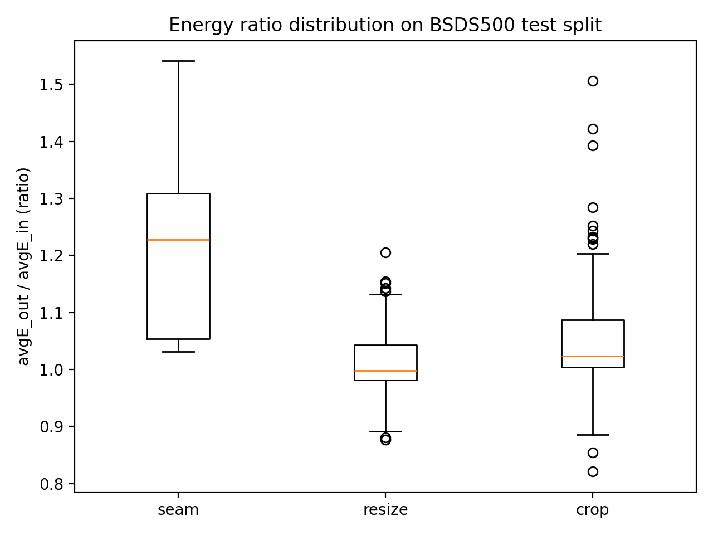

# Content-Aware Image Retargeting via DP Seam Carving


A Python implementation of **content-aware image reduction** using seam carving and dynamic programming. The project removes low-energy vertical and/or horizontal seams from images so that important edges and textured regions are preferentially preserved during resizing.

> The repository includes:
> - a command-line seam-carving implementation,
> - an evaluation script that compares seam carving against bicubic resize and center crop baselines,
> - a plotting script for the included evaluation CSV, and
> - sample BSDS500-style image splits and generated outputs.

## Author
[Chloe Xin DAI](https://github.com/PhDinTimeManagement) <br>

## Project Demo

| Original | Width Reduction                                                                   | Height Reduction                                                                   | Width + Height Reduction                                                              |
| --- |-----------------------------------------------------------------------------------|------------------------------------------------------------------------------------|---------------------------------------------------------------------------------------|
|  |  |  |  |

The included evaluation plot summarizes the energy-ratio distribution for seam carving, bicubic resize, and center crop on the test split:

<p align="center">
  
</p>

## Features

- **Vertical seam removal** for width reduction.
- **Horizontal seam removal** for height reduction, implemented by transposing the image and reusing the vertical seam routine.
- **Two-dimensional retargeting** with a transport-map-style dynamic program that chooses an order of vertical and horizontal seam removals.
- **Gradient-based energy map** computed from grayscale luminance using an L1 central-difference approximation.
- **Evaluation pipeline** for comparing:
  - seam carving,
  - bicubic resize, and
  - center crop.
- **CSV reporting** with average energy, energy delta, energy ratio, runtime, seam cost, and output paths.
- **Optional visualization outputs** for side-by-side qualitative inspection.

## Tech Stack

| Area | Tools |
| --- | --- |
| Language | Python 3 |
| Image processing | Pillow, NumPy |
| Plotting | Matplotlib |
| CLI | `argparse` |
| Data format | JPEG/PNG images, CSV evaluation output |

No environment variables are required.

## Repository Structure

```text
Content-Aware Image Retargeting via DP Seam Carving
├── README.md
├── LICENSE
├── seam_carving_dp.py        # Core seam-carving algorithm and CLI
├── evaluate.py               # Batch evaluation against resize/crop baselines
├── plot_eval.py              # Box-plot generator for evaluation CSV
├── data/
│   └── images/
│       ├── train/            # 200 usable JPEG images in the uploaded project
│       ├── val/              # 100 usable JPEG images in the uploaded project
│       └── test/             # 200 usable JPEG images in the uploaded project
└── output/
    ├── 8068_w.jpg            # Sample width-reduced output
    ├── 8068_h.jpg            # Sample height-reduced output
    ├── 8068_opt.jpg          # Sample width+height output
    ├── eval_w300_test.csv    # Included evaluation CSV
    ├── plot_ratio_box.png    # Included evaluation plot
    └── vis_w300/             # Generated comparison images from evaluation
```

## Installation

Run the commands from the repository root.

```bash
python3 -m venv .venv
source .venv/bin/activate
python3 -m pip install --upgrade pip
python3 -m pip install numpy pillow matplotlib
```

On Windows PowerShell, activate the virtual environment with:

```powershell
.\.venv\Scripts\Activate.ps1
```

### Dependency Notes

- `numpy` and `pillow` are required for `seam_carving_dp.py` and `evaluate.py`.
- `matplotlib` is required only for `plot_eval.py`.
- The repository currently does **not** include a `requirements.txt` or `pyproject.toml`; install the dependencies above manually or add a dependency file before packaging the project.

## How the Algorithm Works

1. Convert the RGB image to grayscale using luminance weights.
2. Compute an energy map using the L1 magnitude of central differences:
   - horizontal gradient: left/right difference,
   - vertical gradient: up/down difference.
3. Use dynamic programming to find the minimum-energy vertical seam.
4. Remove one seam and recompute the energy map on the updated image.
5. Repeat until the requested target dimension is reached.

For height reduction, the image is transposed, processed with the same vertical seam routine, and transposed back.

For simultaneous width and height reduction, `retarget_optimal_order()` builds a dynamic-programming table over the number of removed horizontal and vertical seams. At each state, it compares the cumulative cost of removing the next horizontal seam versus the next vertical seam and keeps the cheaper path.

## Command-Line Usage

### 1. Reduce Image Width

```bash
mkdir -p output
python3 seam_carving_dp.py \
  --input data/images/test/8068.jpg \
  --output output/8068_w.jpg \
  --target-width 400
```

### 2. Reduce Image Height

```bash
mkdir -p output
python3 seam_carving_dp.py \
  --input data/images/test/8068.jpg \
  --output output/8068_h.jpg \
  --target-height 300
```

### 3. Reduce Width and Height Together

```bash
mkdir -p output
python3 seam_carving_dp.py \
  --input data/images/test/8068.jpg \
  --output output/8068_opt.jpg \
  --target-width 400 \
  --target-height 300
```

Useful options:

| Option | Description |
| --- | --- |
| `--target-width` | Target width in pixels. Must be less than or equal to the original width. |
| `--target-height` | Target height in pixels. Must be less than or equal to the original height. |
| `--no-verbose` | Suppress seam-removal progress logs. |
| `--no-sequence` | Suppress the printed horizontal/vertical operation sequence for two-dimensional retargeting. |

## Evaluation

`evaluate.py` compares seam carving with two baselines:

| Method | Description |
| --- | --- |
| `seam` | The DP seam-carving implementation in `seam_carving_dp.py`. |
| `resize` | Bicubic resizing using Pillow. |
| `crop` | Center crop to the target dimensions. |

### Quick Smoke Test

```bash
python3 evaluate.py \
  --images-root data/images \
  --split test \
  --target-width 480 \
  --methods seam,resize,crop \
  --max-images 1 \
  --out-csv output/eval_smoke.csv \
  --save-outputs output/vis_smoke \
  --no-verbose
```

### Full Width-Reduction Evaluation

```bash
python3 evaluate.py \
  --images-root data/images \
  --split test \
  --target-width 300 \
  --methods seam,resize,crop \
  --out-csv output/eval_w300_test.csv \
  --save-outputs output/vis_w300
```

For two-dimensional evaluation, provide both target dimensions:

```bash
python3 evaluate.py \
  --images-root data/images \
  --split test \
  --target-width 400 \
  --target-height 300 \
  --methods seam,resize,crop \
  --seam-order optimal \
  --out-csv output/eval_400x300_test.csv \
  --save-outputs output/vis_400x300
```

Supported seam orders for two-dimensional reduction are:

| `--seam-order` value | Behavior |
| --- | --- |
| `optimal` | Uses the transport-map-style DP in `retarget_optimal_order()`. |
| `width-first` | Removes all vertical seams before horizontal seams. |
| `height-first` | Removes all horizontal seams before vertical seams. |

### Evaluation Metrics

The evaluation CSV includes:

| Column | Meaning |
| --- | --- |
| `avgE_in` | Average energy per pixel in the input image. |
| `avgE_out` | Average energy per pixel in the output image. |
| `delta` | `avgE_out - avgE_in`. |
| `ratio` | `avgE_out / avgE_in`. |
| `runtime_s` | Runtime for the method on that image. |
| `seam_cost` | Total removed seam cost for the seam method. |
| `seam_mode` | Seam-carving mode used, such as `width-only`, `height-only`, or `optimal`. |
| `output_path` | Saved visualization output path, when `--save-outputs` is provided. |

A higher `delta` or `ratio` means the output retained or concentrated more high-energy pixels under this project’s gradient-energy proxy. This is useful for comparison, but it is not a complete perceptual-quality metric.

The included `output/eval_w300_test.csv` contains 600 rows: 200 test images evaluated with three methods. Its mean `ratio` values are approximately:

| Method | Mean Ratio |
| --- |-----------:|
| `seam` |     1.2059 |
| `resize` |     1.0135 |
| `crop` |     1.0512 |

## Plotting Results

`plot_eval.py` reads the included CSV path and writes a box plot:

```bash
python3 plot_eval.py
```

By default, the script uses these fixed paths:

```python
CSV_PATH = "output/eval_w300_test.csv"
OUT_PNG  = "output/plot_ratio_box.png"
```

Edit those constants in `plot_eval.py` if you want to plot a different evaluation file.

## References

1. S. Avidan and A. Shamir, “Seam carving for content-aware image resizing,” *ACM Transactions on Graphics*, vol. 26, no. 3, July 2007. DOI: `10.1145/1276377.1276390`.
2. P. Arbeláez, M. Maire, C. Fowlkes, and J. Malik, “Contour detection and hierarchical image segmentation,” *IEEE Transactions on Pattern Analysis and Machine Intelligence*, vol. 33, no. 5, pp. 898–916, May 2011. DOI: `10.1109/TPAMI.2010.161`.
